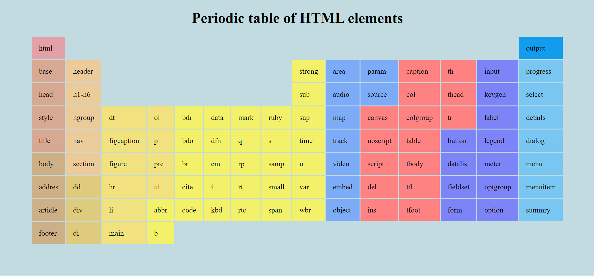

# Tabel Periodik #

Aplikasi ini adalah tabel periodik yang dibuat dengan HTML, ya gess! Tampilannya simpel dan gampang dipahami, jadi kamu bisa cepat cari info tentang unsur-unsur kimia. Setiap unsur dilengkapi dengan detail penting seperti simbol, nomor atom, dan nama. Aplikasi ini dirancang buat bantu kamu belajar kimia dengan cara yang asyik. Cocok banget buat pelajar yang pengen ngerti tabel periodik tanpa ribet!